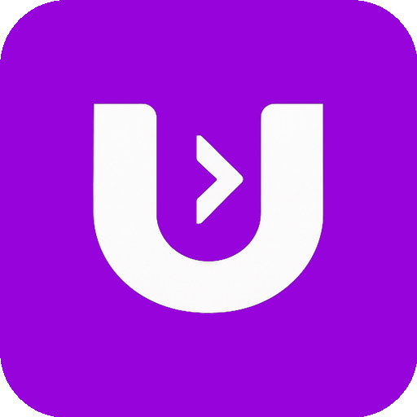

<div align="center">
  

  # Agent Library

  **Professional AI Agent Configurations for Multiple Editors**

  [](https://www.npmjs.com/package/@ulpi/agent-library)
  [](https://www.npmjs.com/package/@ulpi/agent-library)
  [](https://opensource.org/licenses/MIT)
  [](https://ulpi.io)

</div>

---

Production-ready AI agent configurations for **5 editors** × **7 frameworks** = **35 specialized agents**.

Supports: [ULPI](https://ulpi.io) · [Cursor](https://cursor.sh/) · [Amazon Q](https://aws.amazon.com/q/developer/) · [Claude Code](https://claude.ai/code) · [GitHub Codex](https://github.com/features/copilot)

## Documentation

### 📚 Editor Guides
- [Amazon Q Developer](docs/editors/amazonq.md)
- [Cursor](docs/editors/cursor.md)
- [Claude Code](docs/editors/claude.md)
- [ULPI](docs/editors/ulpi.md)
- [GitHub Codex](docs/editors/codex.md)
- [MCP Servers Setup](docs/editors/mcp-servers.md)

### 🚀 Framework Guides
- [Laravel 12.x](docs/frameworks/laravel.md)
- [Express.js](docs/frameworks/express.md)
- [NestJS](docs/frameworks/nestjs.md)
- [Next.js 14/15](docs/frameworks/nextjs.md)
- [Expo React Native](docs/frameworks/expo-react-native.md)
- [Flutter](docs/frameworks/flutter.md)
- [Magento 2](docs/frameworks/magento.md)

## Quick Start

### Installation

**Step 1: Install globally via npm**

```bash
npm install -g @ulpi/agent-library
```

**Step 2: Run the installer in your project**

```bash
cd /path/to/your/project
ulpi-agent-library
```

The interactive installer will:
1. Prompt you to select your framework (Laravel, Next.js, Express, NestJS, etc.)
2. Ask which editors to configure (ULPI, Cursor, Amazon Q, Claude Code, Codex, or all)
3. Download and install the appropriate agent configurations
4. Set up MCP servers (Context7 & Chrome DevTools) for enhanced AI capabilities
5. Create all necessary configuration files in your project

**Command-Line Options:**
```bash
# Interactive mode (prompts for framework and editors)
ulpi-agent-library

# Specify framework and editors
ulpi-agent-library --framework laravel --editors cursor

# Install all editors for Next.js
ulpi-agent-library --framework nextjs --editors all

# Multiple editors
ulpi-agent-library --framework express --editors ulpi,cursor,claude

# Custom directory and port
ulpi-agent-library --target /my/project --port 9000

# Preview without installing
ulpi-agent-library --framework nestjs --dry-run

# Show help
ulpi-agent-library --help
```

**Options:**
- `-f, --framework` - `laravel`, `express`, `nestjs`, `nextjs`, `expo-react-native`, `flutter`, `magento`
- `-e, --editors` - `all`, `ulpi`, `cursor`, `amazonq`, `claude`, `codex` (comma-separated)
- `-t, --target` - Installation directory (default: current)
- `-p, --port` - Chrome debug port (default: 9222)
- `--dry-run` - Preview without installing
- `-h, --help` - Show help

### Manual Installation

Clone the repository and copy the configurations you need:

```bash
git clone https://github.com/ulpi-io/agent-library.git
cd agent-library

# Copy all configurations to your project
cp -r .amazonq /path/to/your/project/
cp -r .cursor /path/to/your/project/
cp -r .claude /path/to/your/project/
cp -r .ulpi /path/to/your/project/
cp .mcp.json /path/to/your/project/
```

## Structure

```
.
├── .amazonq/
│   └── rules/
│       └── laravel.rule.md        # Laravel development rule for Amazon Q
├── .cursor/
│   └── agents/
│       ├── AGENTS.md              # Global Cursor agent instructions
│       └── laravel/
│           └── AGENTS.md          # Laravel Senior Engineer agent for Cursor
├── .claude/
│   └── agents/
│       └── engineering/
│           └── laravel-senior-engineer.md  # Claude Code agent
├── .codex/
│   └── laravel.md                 # Codex Laravel agent (copied to project root as AGENTS.md)
├── .ulpi/
│   ├── agents/
│   │   └── engineering/
│   │       └── laravel-senior-engineer.yaml  # ULPI agent configuration
│   └── tools/
│       ├── launch-chrome-debug.sh # Chrome debugging launch script
│       └── setup.sh               # One-command setup script
└── .mcp.json                      # MCP server configurations
```

## Features

### 🎯 Comprehensive Coverage
- **35 Agent Configurations** - 5 editors × 7 frameworks
- **Full Compatibility** - Every framework works with every editor
- **Production-Ready** - Enterprise patterns and best practices
- **MCP Integration** - Enhanced capabilities via Context7 and Chrome DevTools

### 📦 Supported Editors
- **[ULPI](docs/editors/ulpi.md)** - YAML-based structured agents
- **[Cursor](docs/editors/cursor.md)** - Hierarchical AGENTS.md files
- **[Amazon Q](docs/editors/amazonq.md)** - Project-local .rule.md files
- **[Claude Code](docs/editors/claude.md)** - Markdown agent files
- **[GitHub Codex](docs/editors/codex.md)** - Root AGENTS.md format

### 🚀 Supported Frameworks
- **[Laravel 12.x](docs/frameworks/laravel.md)** - Multi-database, Queues, Horizon
- **[Express.js](docs/frameworks/express.md)** - REST APIs, Middleware
- **[NestJS](docs/frameworks/nestjs.md)** - TypeScript, DI, Bull Queues
- **[Next.js 14/15](docs/frameworks/nextjs.md)** - App Router, Server Components
- **[Expo React Native](docs/frameworks/expo-react-native.md)** - Cross-platform Mobile
- **[Flutter](docs/frameworks/flutter.md)** - Dart, Multi-platform
- **[Magento 2](docs/frameworks/magento.md)** - E-commerce, DI, Plugins

## MCP Servers

Extend AI capabilities with Model Context Protocol servers. **[Full Setup Guide →](docs/editors/mcp-servers.md)**

### Context7
Enhanced documentation lookup and context management for modern frameworks.

### Chrome DevTools
Browser automation, testing, and debugging via Chrome DevTools Protocol.

**Quick Start:**
```bash
# Launch Chrome with remote debugging
./.ulpi/tools/launch-chrome-debug.sh

# Or manually (macOS)
"/Applications/Google Chrome.app/Contents/MacOS/Google Chrome" \
  --remote-debugging-port=9222 \
  --user-data-dir="$(mktemp -d)"
```

The setup script automatically configures MCP servers for all editors.

## Contributing

Contributions are welcome! Please read our [contributing guidelines](CONTRIBUTING.md) before submitting pull requests.

## Support

- **Documentation:** Browse [editor guides](docs/editors/) and [framework guides](docs/frameworks/)
- **Issues:** Report bugs or request features on [GitHub Issues](https://github.com/ulpi-io/agent-library/issues)
- **Website:** Visit [ulpi.io](https://ulpi.io) for more information

---

## License

MIT
